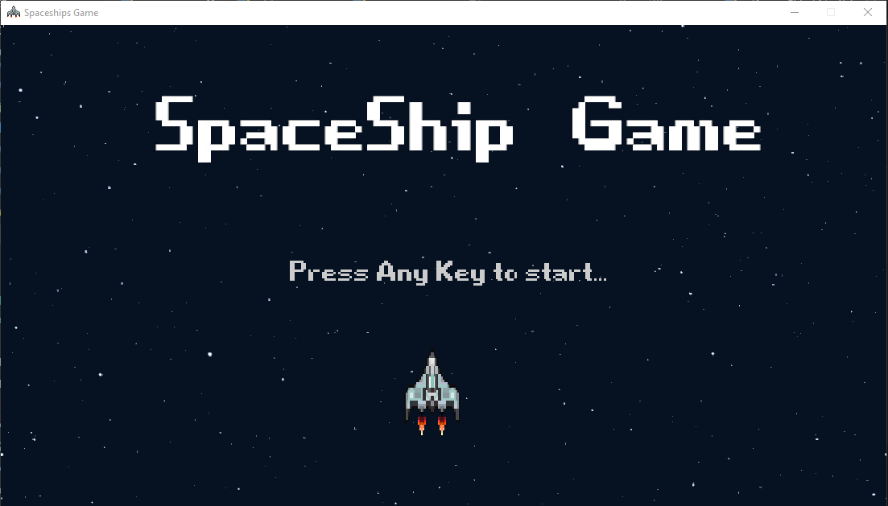
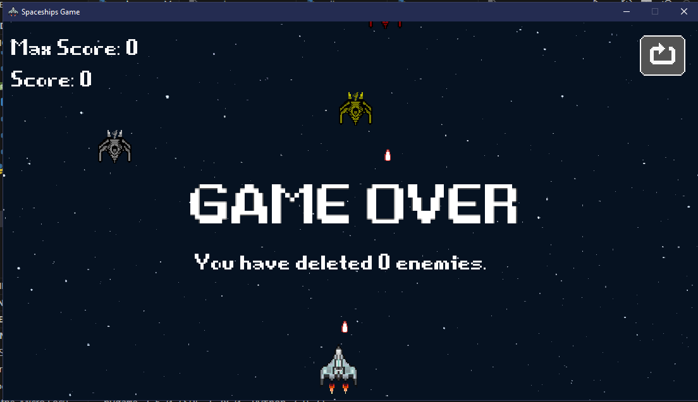

# 2023-6-CO-G8Modulo-2!
Querido viajero espacial:
Bienvenido a Proyect Jala University, Mod 2!

Tarea, clase 1: programar limites de la nave espacial.

Tarea, clase 2: Programar tenemos dos enemigos, agregar logica para agregar nave enemiga aleatoriamente, entre las dos.

Tarea, Clase 3: Añadir balas,en clase se añadieroon balas enemigas.

Tarea, Clase 4: Añadir menú y puntaje.

Tares, clase 5: Añadir poderes.

Se usó Python V 3.9.7
creado con la librería PyGame V 2.5.0

La tematica es retro del Juego SpaceShip, tu nave viaja a través del espacio, pero ten cuidado tendrás enemigos en tu camino!!

Las instrucciones son bastante sencillas:

Da espacio en el teclado para iniciar el Juego, con flechas derecha, izquierda, arriba y abajo se puede mover la Nave del jugador, si un enemigo te impacta o impactas directamente con el enemigo mueres, actualmente tiene implementado 3 poderes diferentes:

Shield: te da un escudo temporal de entre 3 a 5 segundos aleatorios, tambien se adquiere el poder de chocar enemigos y aniquilarlos, pero cuidado ya que son pocos segundos!, no acumulable.

Rapid Fire: al tomar este poder la nave dispara dos veces mas rapido, beneficio solo por 3 -5 segundos, no acumulable.

Vida Extra: al tomar este poder adquieres una vida extra, acumulable, solo una extra como máximo.

Los poderes no acumulables quiere decir que si tomas uno diferente se reemplaza por el que has tomado, en cuanto a los acumulables no importa si tienes otros poderes igual se toma y se almacena dado el caso.

Intenta tener el Máximo Score del Mundo!! no hay limites!! 

